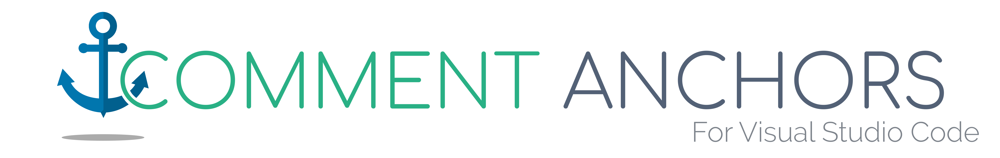
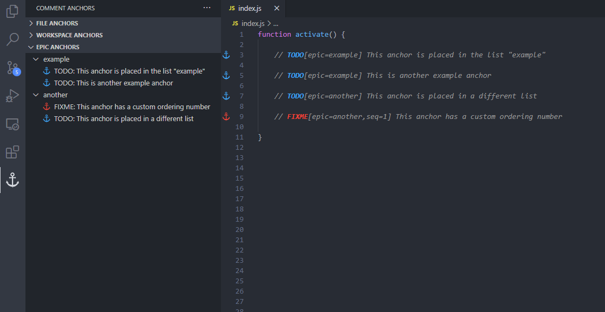
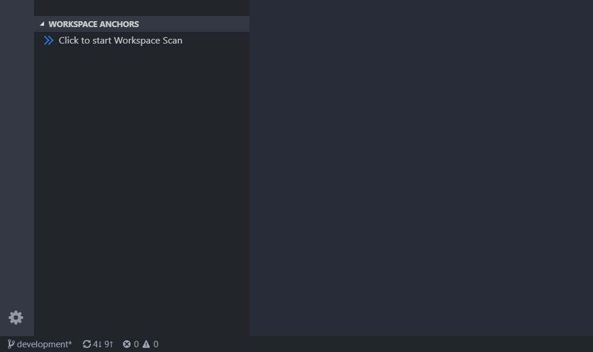
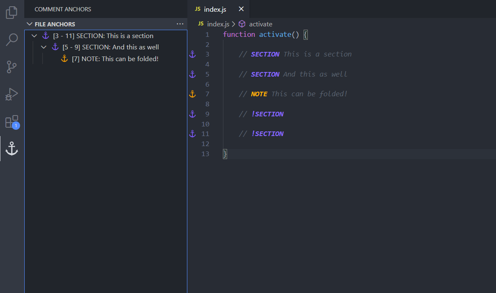
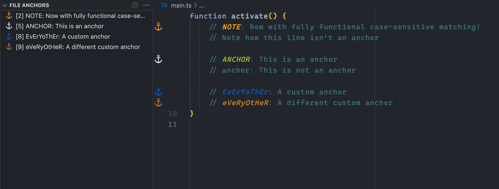
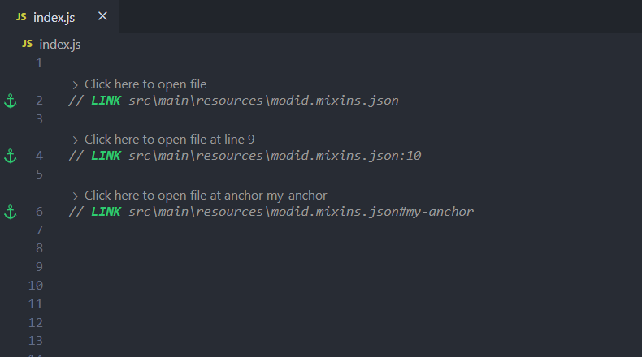
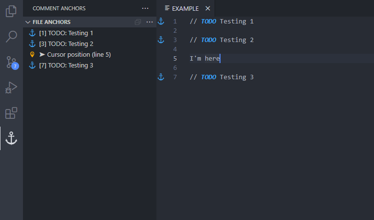
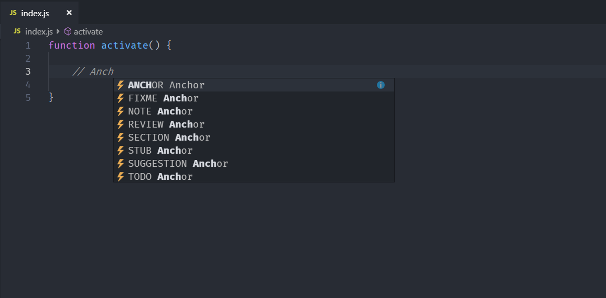

Place anchors within comments or strings to place bookmarks within the context of your code. Anchors can be used to track TODOs, write notes, create foldable sections, or to build a simple navigation making it easier to navigate your files.

Anchors can be viewed for the current file, or throughout the entire workspace, using an easy to use sidebar.

Comment Anchors provides many configuration options, allowing you to tailor this extension to your personal workflow, and increase productivity. Check below for a complete list of features!

### Changelog
The changelog can be found [here](CHANGELOG.md)

# Feature breakdown

* Place anchors in any file for any language
* Anchors can be viewed in the anchor list sidebar
* Anchor names, colors, highlight colors, and much more can be customized (See below for examples)
* Click an anchor in the anchor list to scroll it into view
* Navigate to the previous or next anchor using keybinds
* Quickly toggle tag visibility with commands
* View anchors across your entire workspace
* Scope anchors to be visible in your entire workspace, or just the current file
* Place your anchors into hierarchical sections using region anchors
* Group anchors into custom lists by tagging anchors with an epic
* Export all anchors in your workspace as JSON or CSV

# Usage

The default settings come with anchors for the following tags:

* ANCHOR - Used to indicate a section in your file
* TODO - An item that is awaiting completion
* FIXME - An item that requires a bugfix
* STUB - Used for generated default snippets
* NOTE - An important note for a specific code section
* REVIEW - An item that requires additional review
* SECTION - Used to define a region (See 'Hierarchical anchors')
* LINK - Used to link to a file that can be opened within the editor (See 'Link Anchors')

Of course you can add your own anchors as well!
In order to make an anchor, simply place the tag name in a comment, with an additional anchor message behind it. The anchor will be automatically detected and added to the Anchor List in the activity sidebar.

You can also easily navigate between the anchors in the current file using `Alt + PageUp` or `Alt + PageDown`.


## Anchor types

All anchor types have their own highlight color, and background color, and more, which can all be customized in the settings. Anchor tags can be added and removed, and can share the same icon or color. You can specify and use any hex color for the highlighting and icons, giving you full control over your personal set of anchor tags.


In case you want to disable one or more default tags, simply set the `enabled` property to `false` (See configuration section).

## Workspace anchors

Besides displaying anchors found in the current file, the sidebar also displays a list of
tags it found across all files in your workspace. These anchors are displayed per file, and can
be used as quick navigation.

The visibility of anchor tags in the workspace list can be altered using the 'scope' property on each tag (See configuration section).


## Anchor epics

Epics give you the power to easily tag classes, methods, and entire sections of codes into personal lists. To get started, tag your individual anchors with an Epic to place them into a specific list. Optionally provide a sequence number to customize the ordering of your anchors.



### Lazy loading

Since workspace anchors are usually scanned at startup, this can increase load time for projects containing many
files and folders. In this case you can enable lazy loading mode, which will require an additional manual trigger to start the scan.

Lazy workspace loading can be enabled in the settings (See configuration section).



## Hierarchical anchors
Region Anchors allow you to group relevant Comment Anchors together in regions, which can be
folded within the anchor sidebar. These anchors act nearly identical to regular anchors,
however they require an end tag to be specified, which is simply a tag of the same type, prefixed with an exclamation mark.



In order to mark a tag as Region Tag, set the `behavior` property to `"region"` in the tags configuration (See configuration section).

A default region tag is provided, called "SECTION"

## Tag customization

Comment Anchors supports a vast range of tag customization options. All tags can be modified, including the default tags. This allows you to define tags useful for your workflow.

See the configuration section for a complete list of tag properties.




## Link Anchors

Sometimes you might want to link to a file from within a comment. In these cases, a link anchor
might provide to be useful to you. Using the default `LINK` tag you can provide a relative or
absolute path to a file. These anchors will render with a clickable CodeLens line, used to quickly open it within your editor.

Custom link tags can be created by setting `behavior` to `"link"`

### Linking to a line number

You can specify a line number to scroll to by appending the path with `:` followed by the line number.

Example: `// LINK some/file.txt:50`

### Linking to a specific anchor

Link anchors can take you to another anchor in the target file by appending the path with `#` followed by the anchor id.
The anchor id can be specified as an attribute.

Example: `// LINK some/file.txt#my-anchor` \
Takes you here: `// ANCHOR[id=my-anchor] This is the destination!`

You can even omit the path entirely and link directly to an anchor or line within the current file

Example: `// LINK #error-handling`



## Display cursor position

Enable the `commentAnchors.showCursor` setting to display a file view entry for your current cursor position, making it even easier to see where you are in your current file relative to your anchors.



## IntelliSense support

Comment Anchors can be autocompleted by IntelliSense.



# Commands

\> **List configured anchor tags**

Displays all configured tags in a preview tab, useful for when you are creating your own tags.

\> **Toggle the visibility of comment anchors**

Toggles the visibility of comment anchors (Duh!). Note that his command will update your settings in order to toggle the visibility.

\> **Export all workspace anchors**

Export all workspace anchors to a CSV or JSON file

# Configuration

Use `commentAnchors.parseDelay` to alter the delay in milliseconds between when you stop with typing and when the anchor parser starts. Increasing this value can result in better performance. (Default 200)

```
{
	"commentAnchors.parseDelay": 200
}
```

Use `commentAnchors.scrollPosition` to alter where to position the anchor when scrolled to (Default top)

```
{
	"commentAnchors.scrollPosition": "top"
}
```

Use `commentAnchors.showCursor` to display the current cursor as entry in the file anchor view. (Default false)

```
{
	"commentAnchors.showCursor": false
}
```

Use `commentAnchors.tagHighlights.enabled` to set whether tags are highlighted. (Default true)

```
{
	"commentAnchors.tagHighlights.enabled": true
}
```

Use `commentAnchors.workspace.enabled` to activate workspace wide anchor scanning. This will list out all files containing comment anchors in the "Workspace Anchors" view. (Default true)

```
{
	"commentAnchors.workspace.enabled": true
}
```

Use `commentAnchors.workspace.lazyLoad` to delay the loading of workspace anchors until a manual confirmation is given. It is discouraged
to disable this setting for large workspaces. (Default true)

```
{
	"commentAnchors.workspace.lazyLoad": true
}
```

Use `commentAnchors.workspace.maxFiles` to change how many workspace files will be indexed and displayed in the workspace anchors list. (Default 50) 

```
{
	"commentAnchors.workspace.maxFiles": 50
}
```

Use `commentAnchors.workspace.matchFiles` to define which files are scanned by Comment Anchors. This setting can be used to greatly increase performance in your projects, as by default most files are scanned.

```
{
	"commentAnchors.workspace.matchFiles": "**/*"
}
```

Use `commentAnchors.workspace.excludeFiles` to define which files are excluded from being scanned by Comment Anchors. This setting can be used to greatly increase performance in your projects, as by default only few directories are excluded.

```
{
	"commentAnchors.workspace.excludeFiles": "**/{node_modules,.git,.idea,target,out,build,bin,obj,vendor}/**/*"
}
```

Use `commentAnchors.workspace.pathFormat` to change the way paths are displayed in the workspace anchor tree. You can choose to display full paths, abbreviate folders to single characters, or to hide the path completely. (Default full)

```
{
	"commentAnchors.workspace.pathFormat": "full"
}
```

Use `commentAnchors.tags.provideAutoCompletion` to enable autocompletion support for anchor tags. (Default true)

```
{
	"commentAnchors.tags.provideAutoCompletion": true
}
```

Use `commentAnchors.tags.displayInSidebar` to set whether tags are included in the sidebar list. (Default true)

```
{
	"commentAnchors.tags.displayInSidebar": true
}
```

Use `commentAnchors.tags.displayInGutter` to set whether gutter icons are shown. (Default true)

```
{
	"commentAnchors.tags.displayInGutter": true
}
```

Use `commentAnchors.tags.displayInRuler` to set whether icons are represented by colored bars in the scrollbar ruler. (Default true)

```
{
	"commentAnchors.tags.displayInRuler": true
}
```

Use `commentAnchors.tags.displayLineNumber` to set whether line numbers are displayed in the sidebar (Default true)

```
{
	"commentAnchors.tags.displayLineNumber": true
}
```

Use `commentAnchors.tags.displayTagName` to set whether tag names are displayed in the sidebar (Default true)

```
{
	"commentAnchors.tags.displayTagName": true
}
```

Use `commentAnchors.tags.rulerStyle` to set the appearance in the overview ruler (Default "center")

```
{
	"commentAnchors.tags.rulerStyle": "center"
}
```

Use `commentAnchors.tags.sortMethod` to set the method used to sort anchors by in the sidebar list. Set this to "line" to sort by line number (Default), or "type" to sort by tag type.

```
{
	"commentAnchors.tags.sortMethod": "line"
}
```

Use `commentAnchors.tags.expandSections` to choose whether sections are automatically expanded in the anchor tree.
```
{
	"commentAnchors.tags.expandSections": true
}
```

Use `commentAnchors.tags.separators` to set the list of accepted separators

```
{
	"commentAnchors.tags.separators": [
		" ",
		": ",
		" - "
	]
}
```

Use `commentAnchors.epic.provideAutoCompletion` to enable autocompletion support for epic. (Default true)

```
{
	"commentAnchors.epic.provideAutoCompletion": true
}
```

Use `commentAnchors.epic.seqStep` to config how much should auto-completion-item add on current max-seq. (Default 1)

```
{
	"commentAnchors.epic.seqStep": 1
}
```

## Custom anchor tags

Use `commentAnchors.tags.anchors` to configure the anchor tags. Below is a list of properties each tag can have.


- scope **(required)** - *The scope of a tag. Specifying "file" will only make these visible in the 'File Anchors' list, while "hidden" completely hides it from the anchor list*
- highlightColor - *The color used for highlighting the tag*
- backgroundColor - *The color used as tag background*
- iconColor - *An optional color to apply to the icon, or "auto" for automatic theme detection. Defaults to using highlightColor*
- styleMode - *Customize what part of the comment is highlighted*
- borderStyle - *Style to be applied to the tag border (See https://www.w3schools.com/cssref/pr_border.asp)*
- borderRadius - *The curvature radius of the border (Requires borderStyle)*
- textdecorationStyle - *Style to be applied to the tag text-decoration (See https://www.w3schools.com/cssref/pr_text_text-decoration.php)*
- isBold - *Whether to apply bold formatting to the tag*
- isItalic - *Whether to apply italicized formatting to the tag*
- behavior - *Either "link" for link tags, "region" for region tags, or "anchor" for regular tags*
- enabled - *Allows the disabling of default (and custom) tags*

```
"commentAnchors.tags.anchors": {
	"ANCHOR": {
		"scope": "file",
		"iconColor": "default",
		"highlightColor": "#A8C023",
		"styleMode": "comment"
	},
	...
}
```

You can use the `enabled` property to disable one or more default tags like so:

```
"commentAnchors.tags.anchors": {
	"ANCHOR": {
		"enabled": false
	},
	...
}
```

If you would like for tags to only provide highlighting without rendering in the anchor sidebar, set the `scope` property to `hidden`:

```
"commentAnchors.tags.anchors": {
	"NOTE": {
		"scope": "hidden"
	},
	...
}
```

## Icon colors
At startup, anchor icons are generated for all colors specified on your tags. The icon color defaults to using the tags `highlightColor`,
however a custom color may be specified with `iconColor`. Setting `iconColor` to `auto` will allow VSCode to pick an icon based on your
currentl theme (black or white).

Besides specifying a custom hex color, the following names may be used as shortcuts.

| Color   |     Hex |
|:--------|--------:|
| blue    | #3ea8ff |
| blurple | #7d5afc |
| red     | #F44336 |
| purple  | #BA68C8 |
| teal    | #00cec9 |
| orange  | #ffa100 |
| green   | #64DD17 |
| pink    | #e84393 |
| emerald | #2ecc71 |
| yellow  | #f4d13d |

# Issues

Found a problem or missing feature in Comment Anchors?
Issues and suggestions can be submitted in the GitHub repository [here](https://github.com/StarlaneStudios/vscode-comment-anchors/issues)

If you prefer more direct help, you can join the [Starlane Studios Discord](https://discord.gg/exaQDX2) where you can find most developers of this extension.

## Poor performance?

Comment Anchor scans your entire workspace for tags. This can cause bad performance when your
workspace contains many files, such as dependency directories and logfiles. It is therefore advised to alter the `matchFiles` and `excludeFiles` settings to limit the amount of directories and files scanned.

If you'd rather disable workspace anchors all together, you can disable these in the settings.

# Contribution

You can contribute to comment-anchors by forking the GitHub [repository](https://github.com/StarlaneStudios/vscode-comment-anchors) and submitting pull requests.

## Are you enjoying Comment Anchors?

Feel free to leave us a tip to support our development!

Paypal: https://paypal.me/ExodiusStudios

### **Thanks for using Comment Anchors! ❤️**
